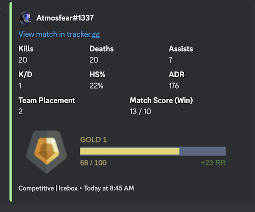

# Discord Valorant Tracker
Sends a message to a channel in a server whenever a tracked player finishes a Valorant competitive match

## Setup

### Discord 
Create a discord bot with a send messages permission and bot and application.commands scopes 

Note this bot is NOT meant to be added to multiple servers. It is meant to be a private bot.

### MongoDB
Create a [mongodb](https://www.mongodb.com/) database 
Create a .env file with your mongodb credentials
```
DB_CONN_STRING="<connection string>"
DB_NAME="<db_name>"
PLAYERS_COLLECTION_NAME="<collection to keep tracked players>"
```

### config file
Create a `config.json` file (see `sample-config.json`). You will need:
 - `discordToken`: Discord bot token
 - `clientId`: Discord bot client id
 - `guildId`: The guild ID the bot will post in
 - `valorantAPIToken`: Optional: HenrikDev Valorant token
 - `trackIntervalSeconds`: The interval the bot will check for new matches. Note this affects the rate limits for the api


### Node
Install node modules
```
npm install
```

Run the bot
```
npm run start:dev
```

Alternatively build & run
```
npm run compile
npm run start
```

## API Rate Limits
This bot uses the HenrikDev Unofficial Valorant API which has a 30 req / minute max rate limit. The bot will make at most 3 calls per player tracked every minute. If you add a token to the config, the rate limit is increased to 90 req / minute

## Commands

The bot has 2 commands:
- `/track <name> <#tag>` -  Adds a person to track (will post in the same channel)
- `/list` - List the currently tracked players in the configured channel
- `/remove <name> <#tag>` - Remove a player from the tracking list (will remove notifications for every channel)

## Sample notification


